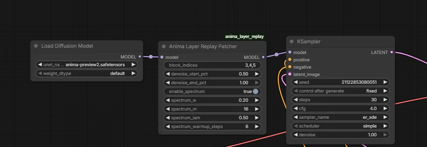

# ComfyUI-Anima-Enhancer

A simple ComfyUI custom node for improving **Anima** generations.

It adds the **Anima Layer Replay Patcher**, which can enhance fine detail and coherence by replaying selected internal blocks during denoising. It also includes an optional **Spectrum** mode for faster generation.

In tested setups, Spectrum can improve generation speed by **around 35%**.

## Features

- Enhances fine detail and structural coherence on Anima models
- Optional built-in Spectrum acceleration
- Supports custom block selection
- Simple workflow integration

## Node

The node appears in ComfyUI as:  **Anima Layer Replay Patcher**

## Automatic Installation

Within ComfyUI's Extension Manager, search for **ComfyUI-Anima-Enhancer** and install it directly.

## Manual Installation

Open a terminal inside your ComfyUI `custom_nodes` folder and run:

```bash
git clone https://github.com/AdamNizol/ComfyUI-Anima-Enhancer.git
````

Then restart ComfyUI.

Example folder layout after installation:

```text
ComfyUI/
└── custom_nodes/
  └── ComfyUI-Anima-Enhancer/
```


## Usage

Add the **Anima Layer Replay Patcher** node to your workflow and connect your model through it. Placing it directly before the sampler is advised.



### Main inputs

* **block_indices**

  Comma-separated block list, for example:

  * `3,4,5`
  * `3,4,5,8`

* **denoise_start_pct**

  When replay begins during denoising

* **denoise_end_pct**

  When replay stops during denoising

* **enable_spectrum**

  Turns on optional Spectrum acceleration

### Spectrum inputs

When Spectrum is enabled, these settings become active:

* **spectrum_w**
* **spectrum_m**
* **spectrum_lam**
* **spectrum_warmup_steps**
* **spectrum_window_size**
* **spectrum_flex_window**

## Recommended starting settings

For many Anima tests, a strong starting point is:

* **block_indices:** `3,4,5`
* **denoise_start_pct:** `0.50`
* **denoise_end_pct:** `1.00`

If using Spectrum, a good starting point is:

* **enable_spectrum:** `true`
* **spectrum_w:** `0.2-0.3`
* **spectrum_m:** `8-16`
* **spectrum_lam:** `0.5`
* **spectrum_warmup_steps:** `6`
* **spectrum_window_size:** `2`
* **spectrum_flex_window:** `0`
 
